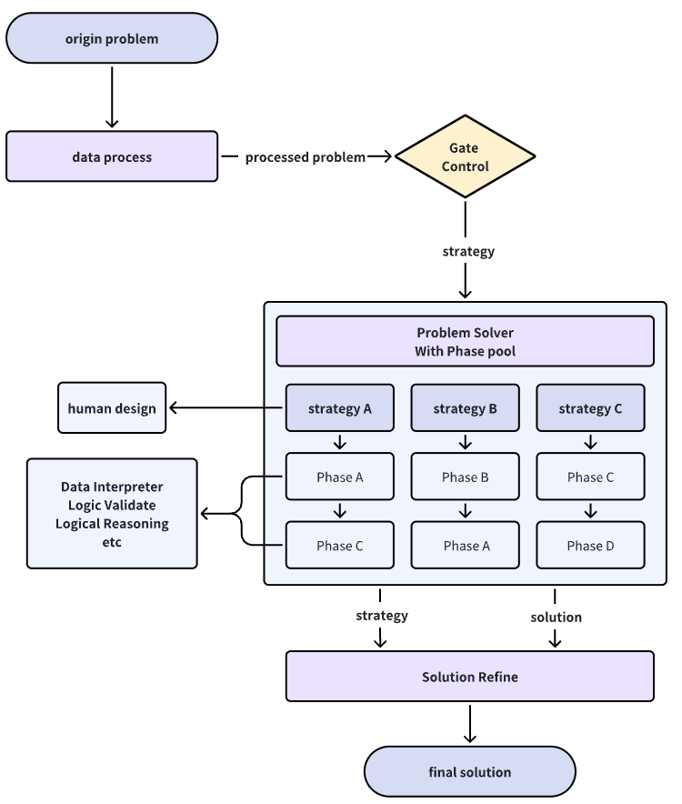

# 方法介绍

# 运行过程

1. 准备问题题库，存为JSON文件，放到 `math_ai/dataset` 文件夹下。JSON文件的格式如下

   ~~~
   {
       '1':{
           'description':'', // 题干内容，从下发的题目文件中抽取得到，编写格式为markdown格式
           'type':'',        // 题目类型。分为简答题 证明题 选择题，有课题目可能涉及两个题型
       },
       '2':{
           'description':'', 
           'type':'',        
       },
       ......
   }
   ~~~

​		 如需复现，我们可以提供处理好的JSON题目。

2. 按照 `Meta_README.md -> Get Started` 中的指示，配置metagpt运行环境

3. 将模型相关参数填充在如下两个地方

   - 根据`Meta_README.md -> Get Started -> Configuration`中的指示，在`~/.metagpt/config2.yaml` 中填充api_type、model、base_url、api_key等等

   - 在 `math_ai/codebase/engine/llm.py` 中，填充自己的base_url和api_key

   在比赛中，我们的模型用的是openai gpt-4-turbo，

4. 在 `run.py` 中填入题库的JSON文件路径，运行 `run.py` 文件，等待运行结果。每道题大约需要5分钟，花费1-2$。

5. 将每道题的运行结果放在 `result` 文件夹中的txt文件。如果遇到乱码问题，请用gbk重新编码。

   在比赛过程中，我们会多次重复上述的答案生成过程，为每道题生成大约10道候选答案，再从中选择合适的答案进行提交。

---

​	NOTE:由于电脑环境不同，如在复现的过程中遇到任何问题，都可以联系我们进行解决！

---

