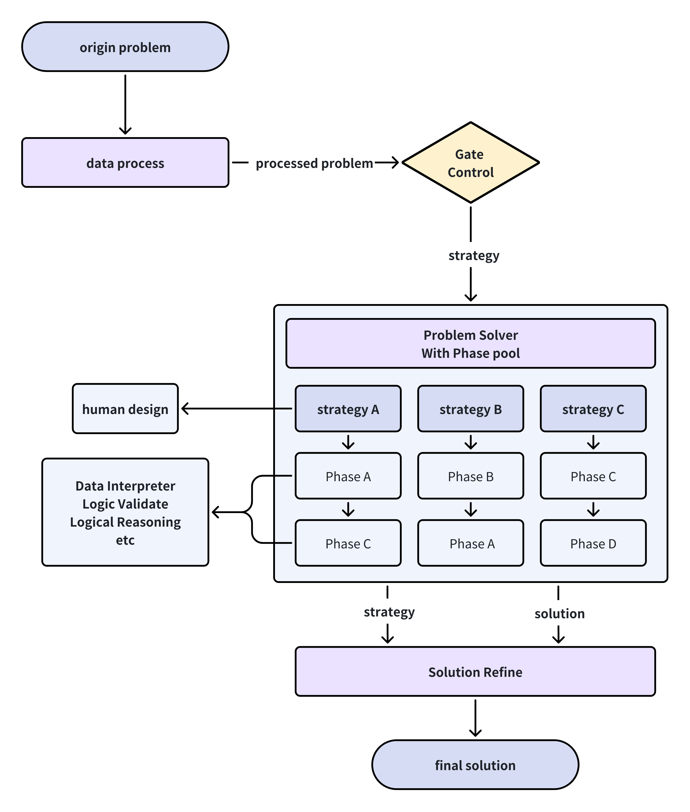

# Math AI
- 团队名称：SuperCarryMan

- 联系方式：<2020201387, 2020201526, 2020201597>@ruc.edu.cn

## 方法介绍

MetaGPT团队最新推出的DataInterpreter框架，以其独特的代码建模方法，为数据科学和数学问题的解决开辟了新途径。然而，这种纯粹依赖于代码建模的解决方案，可能会因缺乏深入的反思和验证过程而导致逻辑上的疏漏。正是基于对这一潜在缺陷的深刻认识，团队进一步开发了Math AI框架，旨在通过综合运用`inference（推理）`、`logic_validate（逻辑验证）`和`data_interpreter（数据解释）`三种高效的推理手段，对复杂的数学问题进行细致的拆解，并针对每个子问题选择合适的逻辑处理阶段，确保形成一个周密、经过多重验证的推理链条。

在初始竞赛问题经过`data_processer`处理后，会形成一个规范化的问题字典。随后，这个字典将在`gate_controller`环节根据问题类型进行分类，并应用由人类专家设计的few-shot策略，以便更高效地进行推理阶段的任务分配。接着，分类后的问题和相应的策略描述将被送往`math_resolver`，进行关键的推理阶段分配。

`math_resolver`的工作流程分为以下几个阶段：

- 推理（inference）阶段：适用于那些不依赖复杂代码建模和精确计算，而是更侧重于逻辑推理的子问题。
- 逻辑验证（logic_validate）阶段：适用于需要对已有推理进行逻辑校验的子问题，确保推理过程的合理性和正确性。
- 数据解释（data_interpreter）阶段：适用于那些需要精确代码建模和计算的复杂子问题，简单的逻辑推理在此可能不足以解决问题。

以下是一个展示`math_resolver`如何分配推理阶段的实例：

``````markdown
- plan:
  - desc: 分析问题陈述中给定的函数 f(𝑥) 的性质，特别是它的单调性和凹性。
    phase: inference
    reason: 理解函数的行为对于确定 K(𝑥) 的行为至关重要，这对于评估等待时间非常关键。
  - desc: 使用函数 f(𝑥) 及其性质推导出等待时间函数 K(𝑥) 的显式形式，并分析等待时间如何随 𝑥 变化。
    phase: di
    reason: 显式计算是必要的，以了解 K(𝑥) 如何随 𝑥 变化，这将有助于预测赛道上棋子的移动。
  - desc: 计算在什么条件下，后来到达树的棋子是否会或不会在等待时间内追上等待中的棋子。
    phase: di
    reason: 使用数学建模和计算分析这些条件将帮助确定棋子何时以及如何相遇。
  - desc: 使用问题(2)中的函数形式和假设小 b 和 𝑥，估计棋子可能在相遇前旅行的轮数。
    phase: di
    reason: 定量估计需要处理对数函数和其中的常数，以近似相遇前所需的迭代或轮数。
  - desc: 通过潜在的特殊案例和边界条件验证整个逻辑论证和计算，以确保结论的普遍适用性。
    phase: logic_validate
    reason: 通过不同的情景检查逻辑和计算，确保解决方案是健壮的，并且普遍适用，而不仅仅是在特定条件下。
``````

为了将这一推理链条转化为人类可读的形式，`MathAI`框架特别引入了润色代理，它能够将推理过程整合并以LaTeX格式呈现，使得最终的解答既准确无误，又易于理解。

Math AI框架的工作流程可以通过以下图表进行直观展示：



所有的prompt可以在`math_ai/codebase/prompt.py`中找到
## 运行过程

1. 准备问题题库，存为JSON文件，放到 `math_ai/dataset` 文件夹下。JSON文件的格式如下

   ~~~
   {
       '1':{
           'description':'', // 题干内容，从下发的题目文件中抽取得到，编写格式为markdown格式
           'type':'',        // 题目类型。分为简答题 证明题 选择题，有课题目可能涉及两个题型
       },
       '2':{
           'description':'', 
           'type':'',        
       },
       ......
   }
   ~~~

   ​		    如需复现，我们可以提供处理好的JSON题目(`math_ai/dataset/2024.json`)。

2. 按照 `Meta_README.md -> Get Started` 中的指示，配置metagpt运行环境

3. 将模型相关参数填充在如下两个地方

   - 根据`Meta_README.md -> Get Started -> Configuration`中的指示，在`~/.metagpt/config2.yaml` 中填充api_type、model、base_url、api_key等等

   - 在 `math_ai/codebase/engine/llm.py` 中，填充自己的base_url和api_key

   在比赛中，我们的模型用的是openai `gpt-4-turbo`，

4. 在 `run.py` 中填入题库的JSON文件路径，运行 `run.py` 文件，等待运行结果。每道题大约需要5分钟，花费1-2$。

5. 将每道题的运行结果放在 `result` 文件夹中的txt文件。如果遇到乱码问题，请用gbk重新编码。

   在比赛过程中，我们会多次重复上述的答案生成过程，为每道题生成大约10道候选答案，再从中选择合适的答案进行提交。(`result/Math_AI_Result.pdf`是我们整理候选答案时保存的文件)

### Notice

1. 在运行过程中，会生成针对某个问题生成的图像界面，请及时关闭图像界面以继续运行。
2. 由于电脑环境不同，如在复现的过程中遇到任何问题，都可以联系我们进行解决！

